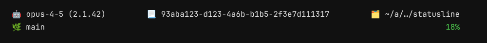

# statusline

Themeable status line provider for Claude Code.

Requires [Bun](https://bun.com).

## Preview

### Default Theme

Two-row layout with model, session, project directory, git status, and context usage:



### Powerline Theme

Single-row powerline-style segments with muted dark backgrounds and arrow separators:


Wraps to multiple lines when segments exceed terminal width. Select with `--theme powerline`.

## Install

```bash
bunx @nutthead/cc-statusline install
```

Then add to `~/.claude/settings.json`:

```json
{
  "statusLine": {
    "type": "command",
    "command": "~/.claude/statusline"
  }
}
```

Use `--overwrite` to replace an existing installation.

## Themes

Built-in themes: `default` (two-row), `powerline` (single-row with powerline arrows).

Use `--theme powerline` to select a built-in theme.

## Custom Themes

Create a JS file that default-exports an async theme function (e.g. `~/.config/cc-statusline/theme.js`):

```js
export default async function theme(input) {
  if (!input) return "";
  const status = JSON.parse(input);
  return `${status.model.display_name} | ${status.workspace.current_dir}`;
}
```

Then point to it in `~/.claude/settings.json`:

```json
{
  "statusLine": {
    "type": "command",
    "command": "~/.claude/statusline --theme-file ~/.config/cc-statusline/theme.js"
  }
}
```

## Available Fields

The JSON object passed to your theme function contains these fields:

| Field                                                      | Example                           |
| ---------------------------------------------------------- | --------------------------------- |
| `session_id`                                               | `"f9abcdef-1a2b-..."`             |
| `transcript_path`                                          | `"/home/user/.claude/transcript"` |
| `cwd`                                                      | `"/home/user/project"`            |
| `model.id`                                                 | `"claude-opus-4-6"`               |
| `model.display_name`                                       | `"Claude Opus 4.6"`               |
| `workspace.current_dir`                                    | `"/home/user/project"`            |
| `workspace.project_dir`                                    | `"/home/user/project"`            |
| `version`                                                  | `"2.1.39"`                        |
| `output_style.name`                                        | `"Explanatory"`                   |
| `context_window.total_input_tokens`                        | `12345`                           |
| `context_window.total_output_tokens`                       | `6789`                            |
| `context_window.context_window_size`                       | `200000`                          |
| `context_window.current_usage`                             | `{ ... }` or `null`               |
| `context_window.current_usage.input_tokens`                | `1024`                            |
| `context_window.current_usage.output_tokens`               | `512`                             |
| `context_window.current_usage.cache_creation_input_tokens` | `256`                             |
| `context_window.current_usage.cache_read_input_tokens`     | `128`                             |
| `context_window.used_percentage`                           | `42.5` or `null`                  |
| `context_window.remaining_percentage`                      | `57.5` or `null`                  |
| `context_window.vim.mode`                                  | `"INSERT"` or `"NORMAL"`          |
| `context_window.agent.name`                                | `"claude-code"`                   |
| `context_window.agent.type`                                | `"main"`                          |

See [`src/schema/statusLine.ts`](src/schema/statusLine.ts) for the full schema.

## Troubleshooting

Execution logs are stored in `~/.local/state/statusline/app.log`.

## License

MIT
